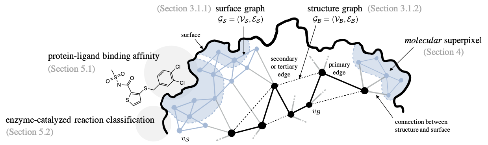

# Multi-Scale Representation Learning on Proteins

(Under Construction and Subject to Change)

This is the official [PyTorch](https://pytorch.org/) implementation for _HoloProt_ ([Somnath et al. 2021](https://openreview.net/forum?id=-xEk43f_EO6))



## Changelog

[30.06.2023]: Added all the raw & processed datasets and binaries to Zenodo.\
[28.06.2023]: Added the binaries configuration used with the paper (Refer to Enviroment Variables section)

## Installation

##### Binaries
Our work utilizes several binaries for generating surfaces, compressing them and computing chemical features and secondary structures.
* [MSMS](http://mgltools.scripps.edu/packages/MSMS/) (2.6.1). To compute the surface of proteins.
* [DSSP](https://swift.cmbi.umcn.nl/gv/dssp/). To compute the secondary structure of proteins.
* [BLENDER](https://www.blender.org/). To fix meshes and remove any redundancies, while reducing them to a desired number of faces.  
* PDB2PQR (2.1.1), multivalue, and [APBS](http://www.poissonboltzmann.org/) (1.5). These programs are necessary to compute electrostatics charges.

##### Environment Variables
After downloading the binaries, one needs to set environment variables to the corresponding paths.

```
echo 'export PROT=/path/to/dir/' >> ~/.bashrc
echo 'export DSSP_BIN=' >> ~/.bashrc
echo 'export MSMS_BIN=/path/to/msms/' >> ~/.bashrc
echo 'export APBS_BIN=/path/to/apbs/bin/apbs' >> ~/.bashrc
echo 'export BLENDER_BIN=/path/to/blender/blender' >> ~/.bashrc
echo 'export PDB2PQR_BIN=/path/to/pdb2pqr/pdb2pqr' >> ~/.bashrc
echo 'export MULTIVALUE_BIN=/path/to/apbs/share/apbs/tools/bin/multivalue' >> ~/.bashrc
source ~/.bashrc
```

As a sanity check for correct installation, try entering `$BINARY_NAME` in the command line, and 
check if it produces a meaningful result. If it throws a lib.xx.xx.so not found, please try setting 
your `LD_LIBRARY_PATH` to the appropriate directories.

The binaries configuration used in this work can be found [here](https://zenodo.org/record/8102783/). 
After untaring the file in an appropriate directory, please add the following commands to your `~/.bashrc` file:

```
export LD_LIBRARY_PATH=$PATH_TO_DIR/binaries/boost/lib:${PATH_TO_MINICONDA}/lib:${PATH_TO_DIR}/binaries/apbs/lib:$HOME/lib:$LD_LIBRARY_PATH
```

##### Final installation
To install all dependencies, run
```
./install_dependencies.sh
```

If you want jupyter notebook support (may have errors), run the following commands (inside `prot`):
```
conda install -c anaconda ipykernel
python -m ipykernel install --user --name=prot
```
Change the kernel name to `prot` or create a new ipython notebook using `prot` as the kernel.

## Datasets
Datasets are organized in the `$PROT/datasets` directory. The raw datasets are placed in `$PROT/datasets/raw`
while the processed datasets are placed in `$PROT/datasets/processed`

### Dataset Download
All datasets used in this work can be found on [zenodo](https://zenodo.org/record/8102783).

1. Download files `DATASET_NAME_raw.tar.gz` to `$PROT/datasets/raw` and extract.
2. Download files `DATASET_NAME_s2b.tar.gz`, `DATASET_NAME_p2b_20.tar.gz` to `$PROT/datasets/processed/DATASET_NAME` and extract.

where `DATASET_NAME` is one of `pdbbind, enzyme`.

### Dataset Cleanup and Running binaries
Before preparing the graph objects, we need to clean up the pdb files and run the binaries. Possible set of tasks include:
* pdbfixer: Clean up PDB files and add any missing residues.
* dssp: Secondary structure computation using the DSSP binary
* surface: Constructs the triangular surface mesh using MSMS and compresses it to a desired size using BLENDER
* charges: Computes electrostatics on the given surface using PDB2PQR, APBS and MULTIVALUE binaries
* all: Runs all the tasks listed above

```
python -W ignore scripts/preprocess/run_binaries.py --dataset DATASET_NAME --tasks TASK_NAME
```
where `DATASET_NAME` can be one of `pdbbind, enzyme`, and `TASK_NAME` is one of `pdbfixer, dssp, surface, charges, all`

### Superpixel Preparation
Molecular superpixels are constructed using a modified version of [ERS](https://www.merl.com/publications/docs/TR2011-035.pdf).
Follow the steps below to first prepare the surface graphs, and then generate the molecular superpixel assignments,
```
python -W ignore scripts/preprocess/prepare_graphs.py --dataset DATASET_NAME --prot_mode surface
python -W ignore scripts/preprocess/generate_patches.py --dataset DATASET_NAME --seg_mode ers --n_segments N_SEGMENTS
```

### HoloProt Graph Construction
```
EXP_NAME="ERS_balance=0.5_n_segments=20"
python -W ignore scripts/preprocess/prepare_graphs.py --dataset DATASET_NAME --prot_mode surface2backbone
python -W ignore scripts/preprocess/prepare_graphs.py --dataset DATASET_NAME --prot_mode patch2backbone --exp_name EXP_NAME --n_segments 20
```

After preprocessing, check if the following directories exist:
`$PROT/datasets/processed/DATASET_NAME/surface2backbone` and `$PROT/datasets/processed/DATASET_NAME/patch2backbone_n_segments=20`

## Running Experiments

We use wandb to track out experiments. Please make sure to have the [setup](https://docs.wandb.ai/quickstart) complete before doing that.

Default configurations for running experiments can be found in `config/train/DATASET_NAME/`

For `PDBBind`, the files are organized as `config/train/pdbbind/SPLIT.yaml` where `SPLIT` is one of `{identity30, identity60, scaffold}`.

For `Enzyme` dataset, the file is `config/train/enzyme/default_config.yaml`.

To run the experiments for `PDBBind`,
```
python scripts/train/run_model.py --config_file config/train/pdbbind/SPLIT.yaml
```

To run experiments for `Enzyme`,
```
python scripts/train/run_model.py --config_file config/train/enzyme/default_config.yaml
```

Please raise an issue if the commands don't work as expected, or you need help interpreting an error message.

## License
This project is licensed under the MIT-License. Please see [LICENSE.md](https://github.com/vsomnath/holoprot/blob/main/LICENSE.md) for more details.

## Reference
If you find our code useful for your work, please cite our paper:
```
@inproceedings{
somnath2021multiscale,
title={Multi-Scale Representation Learning on Proteins},
author={Vignesh Ram Somnath and Charlotte Bunne and Andreas Krause},
booktitle={Advances in Neural Information Processing Systems},
editor={A. Beygelzimer and Y. Dauphin and P. Liang and J. Wortman Vaughan},
year={2021},
url={https://openreview.net/forum?id=-xEk43f_EO6}
}
```

Please also consider citing the MaSIF work, whose code we use for preparing and computing features on surfaces:
```
@article{gainza2020deciphering,
  title={Deciphering interaction fingerprints from protein molecular surfaces using geometric deep learning},
  author={Gainza, P and Sverrisson, F and Monti, F and Rodol{\`a}, E and Boscaini, D and Bronstein, MM and Correia, BE},
  journal={Nature Methods},
  volume={17},
  number={2},
  pages={184--192},
  year={2020},
  publisher={Nature Publishing Group}
}
```

## Contact
If you have any questions about the code, or want to report a bug, or need help interpreting an error message, please raise a GitHub issue.
